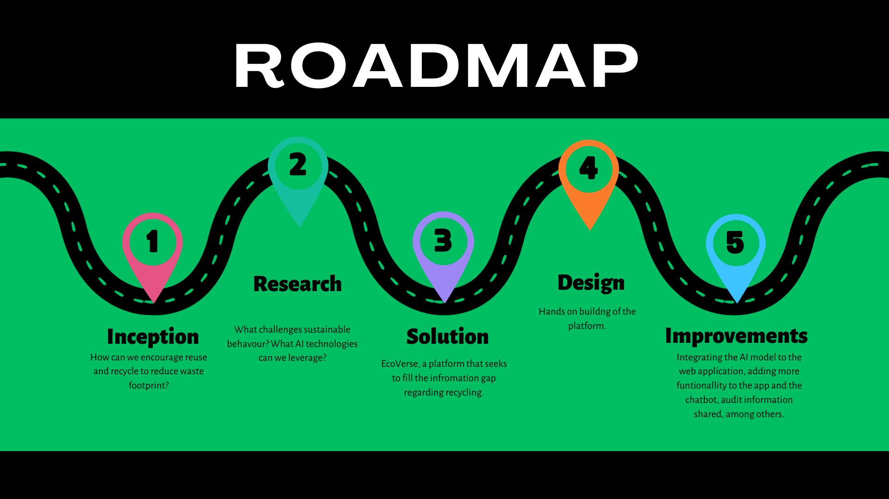

# Eco-conscious-project

- [Eco-conscious-project](#eco-conscious-project)
  - [Project summary](#project-summary)
    - [The issue we are hoping to solve](#the-issue-we-are-hoping-to-solve)
    - [How our technology solution can help](#how-our-technology-solution-can-help)
    - [Our idea](#our-idea)
  - [Technology implementation](#technology-implementation)
    - [IBM AI service(s) used](#ibm-ai-services-used)
    - [Other IBM technology used](#other-ibm-technology-used)
    - [Solution architecture](#solution-architecture)
  - [Presentation materials](#presentation-materials)
    - [Solution demo video](#solution-demo-video)
    - [Project development roadmap](#project-development-roadmap)
  - [Additional details](#additional-details)
    - [How to run the project](#how-to-run-the-project)
    - [Live demo](#live-demo)

## Project summary
 EcoVerse is an innovative platform committed to promoting recycling and reuse opportunities. Through its integrted services like ML image Classification, Conservational Chatbot (Ecobot), blog page, marketplace, and the upcoming communty forum, EcoVerse aims to provide a one-stop solution for all your eco-conscious needs.

### The issue we are hoping to solve
  Our topic of interest was to reduce volume of and demand for material that create the biggest waste footprint, and encourage reuse/recycle opportunities. 
  EcoVerse tackles this challenge by fostering informed and sustainable waste disposal and recycling practices among individuals and communities. 
### How our technology solution can help

Providing reliable infromation,encouraging knowledge sharing, simplifying waste categorization, and facilitating reuse and recycling opportunities through the Marketplace.  

### Our idea
Amidst the bustling life in Kenya, a critical challenge looms large - waste management. The swift urbanization and population surge have intensified the waste disposal problem, impacting both the environment and public health. The urgency for sustainable waste management solutions is evident. 
At the root of all this is lack of awareness. People often subconsciouly harm the environment through normalized societal norms. We aim to change this by providing a one-stop platform for all eco needs. Using our services, we aim to equip masses with knowledge on how they can do better in matters waste management. Having a centralized infromation source will be a game changer in promoting recycling and reuse, overall reducing the waste footprint.

## Technology implementation

### IBM AI service(s) used

_INSTRUCTIONS: Included here is a list of commonly used IBM AI services. Remove any services you did not use, or add others from the linked catalog not already listed here. Leave only those included in your solution code. Provide details on where and how you used each IBM AI service to help judges review your implementation. Remove these instructions._

- [IBM Natural Language Understanding](https://cloud.ibm.com/catalog/services/natural-language-understanding) - In the creation of ecobot, IBM natural language understanding came in handy.
- [Watson Assistant](https://cloud.ibm.com/catalog/services/watson-assistant) - Our conversational chatbot, ecobot is powered and was created using IBM Watson Assistant.


### Other IBM technology used


### Solution architecture

Diagram and step-by-step description of the flow of our solution:


1. The user navigates to the site and chooses a service of his choice.
2. For the ML category, we didn't manage to integrate it with the web app by the submission deadline and we will show a prototype. A user navigates to this option, uploads a image file, which is then sent to the model. The model classifies it and returns the result containing the class of the uploaded item.
3. At the bottom right of our web application, the user will be able to access ecobot, and answer any question regarding waste management and navigating the web page.
4. The blog market place will also be accessible from the landing page.
5. The market place allows users to upload their waste items where potential buyers can reach out.
## Presentation materials

_INSTRUCTIONS: The following deliverables should be officially posted to your My Team > Submissions section of the [Call for Code Global Challenge resources site](https://cfc-prod.skillsnetwork.site/), but you can also include them here for completeness. Replace the examples seen here with your own deliverable links._

### Solution demo video

[](https://youtu.be/vOgCOoy_Bx0)

### Project development roadmap

The project currently does the following things.

- Provides information to users on recyling and reusing.
- Accurately classifies different waste images into their appropriate categories.
- Integrates a conversational chatbot that provides informaton based on user querys.

In the future we plan to...

See below for our proposed schedule on next steps after Call for Code 2023 submission.



## Additional details

_INSTRUCTIONS: The following deliverables are suggested, but **optional**. Additional details like this can help the judges better review your solution. Remove any sections you are not using._

### How to run the project

The frontend is made using react, a javascript framework for building user interfaces, while the backend is made using nodejs.
Navigate into the frontend directory and run npm i, to install node modules and npm run dev, to run the project.
```shell
npm i 

npm run dev
```
To test the model, run the streamlit application by typing streamlit run app.py
```shell
streamlit run app.py
```
### Live demo

You can find a running system to test at [Eco Conscious](
https://eco-conscious-bdc4d.web.app/)

---

